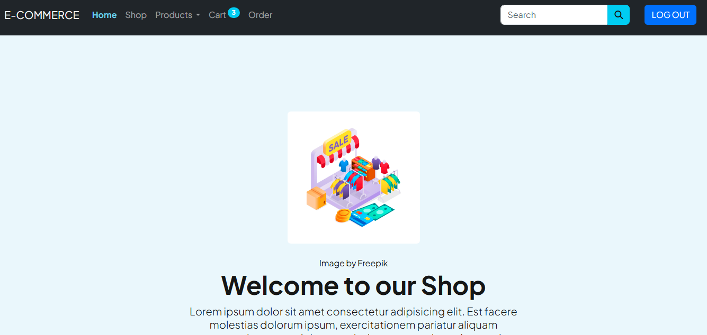

# 🛒 Laravel 11 eCommerce App

A simple eCommerce application built with **Laravel 11** featuring:

-   User authentication (login/register)
-   Admin dashboard
-   Full CRUD for products
-   Responsive UI
-   Blade templates & Tailwind CSS
-   RESTful routing

---

## 🔧 Features

-   🧑‍💼 Admin authentication
-   📦 Manage products (create, read, update, delete)
-   🔐 Middleware-protected admin routes
-   📸 Upload product images
-   🛍️ Customer-friendly interface
-   ✅ Validation and flash messaging
